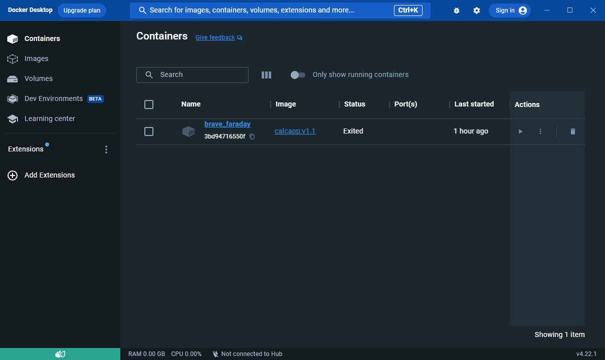
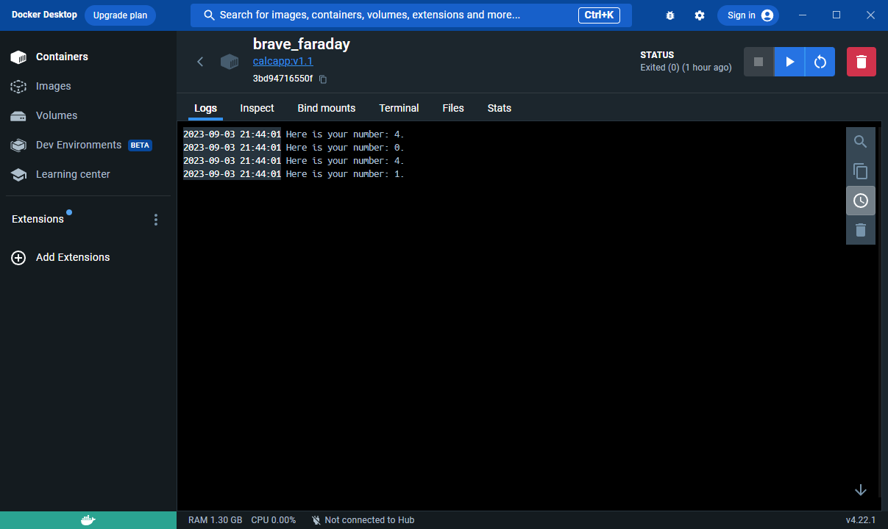

# Разработать приложение.

Создать проект из трёх классов (основной с точкой входа и два класса в другом пакете),
которые вместе должны составлять одну программу, позволяющую
производить четыре основных математических действия и осуществлять форматированный
вывод результатов пользователю (ИЛИ ЛЮБОЕ ДРУГОЕ ПРИЛОЖЕНИЕ НА ВАШ ВЫБОР, которое просто демонстрирует работу некоторого механизма).

Необходимо установить Docker Desktop.

Создать Dockerfile, позволяющий откопировать исходный код вашего приложения в образ для демонстрации работы вашего приложения при создании соответствующего контейнера [Cсылка](https://github.com/ColdSun93/java_core/blob/main/src/main/dockerfile "Файл").

